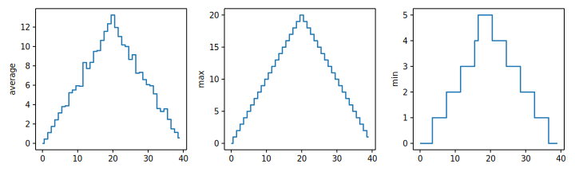

## Visualizing data

The mathematician Richard Hamming once said, "The purpose of computing is insight, not numbers,"
and the best way to develop insight is often to visualize data.  Visualization deserves an entire
lecture of its own, but we can explore a few features of Python's `matplotlib` library here.  While
there is no official plotting library, `matplotlib` is the *de facto* standard.  First, we will
import the `pyplot` module from `matplotlib` and use two of its functions to create and display a
[heat map](../learners/reference.md#heat-map) of our data:


> ## Episode Prerequisites
>
> If you are continuing in the same notebook from the previous episode, you already
> have a `data` variable and have imported `numpy`.  If you are starting a new
> notebook at this point, you need the following two lines:
> 
> ~~~
> import numpy as np
> data = np.loadtxt(fname='data/inflammation-01.csv', delimiter=',')
> ~~~
> {: .python}
{: .prereq}

```python
import matplotlib.pyplot as plt
image = plt.imshow(data)
plt.show()
```

{alt='Heat map representing the data variable. Each cell is colored by value along a color gradientfrom blue to yellow.'}

Each row in the heat map corresponds to a patient in the clinical trial dataset, and each column
corresponds to a day in the dataset.  Blue pixels in this heat map represent low values, while
yellow pixels represent high values.  As we can see, the general number of inflammation flare-ups
for the patients rises and falls over a 40-day period.

So far so good as this is in line with our knowledge of the clinical trial and Dr. Maverick's
claims:

- the patients take their medication once their inflammation flare-ups begin
- it takes around 3 weeks for the medication to take effect and begin reducing flare-ups
- and flare-ups appear to drop to zero by the end of the clinical trial.

Now let's take a look at the average inflammation over time:

```python
ave_inflammation = np.mean(data, axis=0)
ave_plot = matplotlib.pyplot.plot(ave_inflammation)
matplotlib.pyplot.show()
```

{alt='A line graph showing the average inflammation across all patients over a 40-day period.'}

Here, we have put the average inflammation per day across all patients in the variable
`ave_inflammation`, then asked `matplotlib.pyplot` to create and display a line graph of those
values.  The result is a reasonably linear rise and fall, in line with Dr. Maverick's claim that
the medication takes 3 weeks to take effect.  But a good data scientist doesn't just consider the
average of a dataset, so let's have a look at two other statistics:

```python
max_plot = plt.plot(numpy.amax(data, axis=0))
plt.show()
```

{alt='A line graph showing the maximum inflammation across all patients over a 40-day period.'}

```python
min_plot = plt.plot(np.amin(data, axis=0))
plt.show()
```

{alt='A line graph showing the minimum inflammation across all patients over a 40-day period.'}

The maximum value rises and falls linearly, while the minimum seems to be a step function.
Neither trend seems particularly likely, so either there's a mistake in our calculations or
something is wrong with our data. This insight would have been difficult to reach by examining
the numbers themselves without visualization tools.

### Grouping plots

You can group similar plots in a single figure using subplots.
This script below uses a number of new commands. The function `matplotlib.pyplot.figure()`
creates a space into which we will place all of our plots. The parameter `figsize`
tells Python how big to make this space. Each subplot is placed into the figure using
its `add_subplot` [method](../learners/reference.md#method). The `add_subplot` method takes
3 parameters. The first denotes how many total rows of subplots there are, the second parameter
refers to the total number of subplot columns, and the final parameter denotes which subplot
your variable is referencing (left-to-right, top-to-bottom). Each subplot is stored in a
different variable (`axes1`, `axes2`, `axes3`). Once a subplot is created, the axes can
be titled using the `set_xlabel()` command (or `set_ylabel()`).
Here are our three plots side by side:

~~~
import numpy
import matplotlib.pyplot

data = numpy.loadtxt(fname='inflammation-01.csv', delimiter=',')

fig = matplotlib.pyplot.figure(figsize=(10.0, 3.0))

axes1 = fig.add_subplot(1, 3, 1)
axes2 = fig.add_subplot(1, 3, 2)
axes3 = fig.add_subplot(1, 3, 3)

axes1.set_ylabel('average')
axes1.plot(numpy.mean(data, axis=0))

axes2.set_ylabel('max')
axes2.plot(numpy.amax(data, axis=0))

axes3.set_ylabel('min')
axes3.plot(numpy.amin(data, axis=0))

fig.tight_layout()

matplotlib.pyplot.savefig('inflammation.png')
matplotlib.pyplot.show()
~~~
{: .pytho}

{alt='Three line graphs showing the daily average, maximum and minimum inflammation over a 40-day period.'}

The [call](../learners/reference.md#function-call) to `loadtxt` reads our data,
and the rest of the program tells the plotting library
how large we want the figure to be,
that we're creating three subplots,
what to draw for each one,
and that we want a tight layout.
(If we leave out that call to `fig.tight_layout()`,
the graphs will actually be squeezed together more closely.)

The call to `savefig` stores the plot as a graphics file. This can be
a convenient way to store your plots for use in other documents, web
pages etc. The graphics format is automatically determined by
Matplotlib from the file name ending we specify; here PNG from
'inflammation.png'. Matplotlib supports many different graphics
formats, including SVG, PDF, and JPEG.


> ## Importing libraries with shortcuts
>
> In this lesson we use the `import matplotlib.pyplot`
> [syntax](../learners/reference.md#syntax)to import the `pyplot` module of `matplotlib`. However, shortcuts such as`import matplotlib.pyplot as plt` are frequently used.
> Importing `pyplot` this way means that after the initial import, rather than writing
> `plt.plot(...)`, you can now write `plt.plot(...)`.
> Another common convention is to use the shortcut `import numpy as np` when importing the
> NumPy library. We then can write `np.loadtxt(...)` instead of `numpy.loadtxt(...)`,
> for example.
> 
> Some people prefer these shortcuts as it is quicker to type and results in shorter
> lines of code - especially for libraries with long names! You will frequently see
> Python code online using a `pyplot` function with `plt`, or a NumPy function with `np`, and it's because they've used this shortcut. It makes no difference which
> approach you choose to take, but you must be consistent as if you use `import matplotlib.pyplot as plt` then `plt.plot(...)` will not work, and
> you must use `plt.plot(...)` instead. Because of this, when working with other people it is important you agree on how libraries are imported.
{: .callout}


> ## Plot Scaling
> 
> Why do all of our plots stop just short of the upper end of our graph?
> 
> > ## Solution
> >
> > Because matplotlib normally sets x and y axes limits to the min and max of our data (depending on data range)
> >
> { : .solution}
> >
> >
> > If we want to change this, we can use the `set_ylim(min, max)` method of each 'axes',
for example:
> >
> > ~~~
> > axes3.set_ylim(0, 6)
> > ~~~
> > {: .python}
> 
> Update your plotting code to automatically set a more appropriate scale.
> Hint: you can make use of the `max` and `min` methods to help.)
>
> > ## Solution
> > 
> > ```python
> > # One method
> > axes3.set_ylabel('min')
> > axes3.plot(numpy.amin(data, axis=0))
> > axes3.set_ylim(0, 6)
> > ```
> {: .solution}
> 
> > ## Solution
> > 
> > ~~~
> > # A more automated approach
> > min_data = numpy.amin(data, axis=0)
> > axes3.set_ylabel('min')
> > axes3.plot(min_data)
> > axes3.set_ylim(numpy.amin(min_data), numpy.amax(min_data) * 1.1)
> > ~~~
> > {: .python}
> {: .solution}
{: .challenge}


:::::::::::::::::::::::::::::::::::::::  challenge

## Drawing Straight Lines

In the center and right subplots above, we expect all lines to look like step functions because
non-integer value are not realistic for the minimum and maximum values. However, you can see
that the lines are not always vertical or horizontal, and in particular the step function
in the subplot on the right looks slanted. Why is this?

:::::::::::::::  solution

## Solution

Because matplotlib interpolates (draws a straight line) between the points.
One way to do avoid this is to use the Matplotlib `drawstyle` option:

```python
import numpy
import matplotlib.pyplot

data = numpy.loadtxt(fname='data/inflammation-01.csv', delimiter=',')

fig = matplotlib.pyplot.figure(figsize=(10.0, 3.0))

axes1 = fig.add_subplot(1, 3, 1)
axes2 = fig.add_subplot(1, 3, 2)
axes3 = fig.add_subplot(1, 3, 3)

axes1.set_ylabel('average')
axes1.plot(numpy.mean(data, axis=0), drawstyle='steps-mid')

axes2.set_ylabel('max')
axes2.plot(numpy.amax(data, axis=0), drawstyle='steps-mid')

axes3.set_ylabel('min')
axes3.plot(numpy.amin(data, axis=0), drawstyle='steps-mid')

fig.tight_layout()

matplotlib.pyplot.show()
```

{alt='Three line graphs, with step lines connecting the points, showing the daily average, maximumand minimum inflammation over a 40-day period.'}


:::::::::::::::::::::::::

::::::::::::::::::::::::::::::::::::::::::::::::::

:::::::::::::::::::::::::::::::::::::::  challenge

## Make Your Own Plot

Create a plot showing the standard deviation (`numpy.std`)
of the inflammation data for each day across all patients.

:::::::::::::::  solution

## Solution

```python
std_plot = matplotlib.pyplot.plot(numpy.std(data, axis=0))
matplotlib.pyplot.show()
```

:::::::::::::::::::::::::

::::::::::::::::::::::::::::::::::::::::::::::::::

:::::::::::::::::::::::::::::::::::::::  challenge

## Moving Plots Around

Modify the program to display the three plots on top of one another
instead of side by side.

:::::::::::::::  solution

## Solution

```python
import numpy
import matplotlib.pyplot

data = numpy.loadtxt(fname='inflammation-01.csv', delimiter=',')

# change figsize (swap width and height)
fig = matplotlib.pyplot.figure(figsize=(3.0, 10.0))

# change add_subplot (swap first two parameters)
axes1 = fig.add_subplot(3, 1, 1)
axes2 = fig.add_subplot(3, 1, 2)
axes3 = fig.add_subplot(3, 1, 3)

axes1.set_ylabel('average')
axes1.plot(numpy.mean(data, axis=0))

axes2.set_ylabel('max')
axes2.plot(numpy.amax(data, axis=0))

axes3.set_ylabel('min')
axes3.plot(numpy.amin(data, axis=0))

fig.tight_layout()

matplotlib.pyplot.show()
```


## [`matplotlib`](https://matplotlib.org/) is the most widely used scientific plotting library in Python.

- Commonly use a sub-library called [`matplotlib.pyplot`](https://matplotlib.org/stable/tutorials/introductory/pyplot.html).
- The Jupyter Notebook will render plots inline by default.

```python
import matplotlib.pyplot as plt
```

- Simple plots are then (fairly) simple to create.

```python
time = [0, 1, 2, 3]
position = [0, 100, 200, 300]

plt.plot(time, position)
plt.xlabel('Time (hr)')
plt.ylabel('Position (km)')
```

{alt='A line chart showing time (hr) relative to position (km), using the values provided in the code block above. By default, the plotted line is blue against a white background, and the axes have been scaled automatically to fit the range of the input data.'}


> ## Display All Open Figures
> 
>  In our Jupyter Notebook example, running the cell should generate the figure directly below the code.
>  The figure is also included in the Notebook document for future viewing.
>  However, other Python environments like an interactive Python session started from a terminal or a Python script executed via the command line require an additional command to display the figure.
>  
>  Instruct `matplotlib` to show a figure:
>  
>  ```python
>  plt.show()
>  ```
>  
>  This command can also be used within a Notebook - for instance, to display multiple figures if several are created by a single cell.
>  
{: .callout}


## Plot data directly from a [`Pandas dataframe`](https://pandas.pydata.org/pandas-docs/stable/reference/api/pandas.DataFrame.html).

- We can also plot [Pandas dataframes](https://pandas.pydata.org/pandas-docs/stable/generated/pandas.DataFrame.html).
- Before plotting, we convert the column headings from a `string` to `integer` data type, since they represent numerical values,
  using [str.replace()](https://pandas.pydata.org/docs/reference/api/pandas.Series.str.replace.html) to remove the `gpdPercap_`
  prefix and then [astype(int)](https://pandas.pydata.org/docs/reference/api/pandas.Series.astype.html)
  to convert the series of string values (`['1952', '1957', ..., '2007']`) to a series of integers: `[1925, 1957, ..., 2007]`.

```python
import pandas as pd

data = pd.read_csv('data/gapminder_tidy.csv', index_col='country')

# Extract year from last 4 characters of each column name
# The current column names are structured as 'gdpPercap_(year)', 
# so we want to keep the (year) part only for clarity when plotting GDP vs. years
# To do this we use replace(), which removes from the string the characters stated in the argument
# This method works on strings, so we use replace() from Pandas Series.str vectorized string functions

years = data.columns.str.replace('gdpPercap_', '')

# Convert year values to integers, saving results back to dataframe

data.columns = years.astype(int)

data.loc['Australia'].plot()
```

{alt='GDP plot for Australia'}

## Select and transform data, then plot it.

- By default, [`DataFrame.plot`](https://pandas.pydata.org/pandas-docs/stable/generated/pandas.DataFrame.plot.html#pandas.DataFrame.plot) plots with the rows as the X axis.
- We can transpose the data in order to plot multiple series.

```python
data.T.plot()
plt.ylabel('GDP per capita')
```

{alt='GDP plot for Australia and New Zealand'}

## Many styles of plot are available.

- For example, do a bar plot using a fancier style.

```python
plt.style.use('ggplot')
data.T.plot(kind='bar')
plt.ylabel('GDP per capita')
```

{alt='GDP barplot for Australia'}

## Data can also be plotted by calling the `matplotlib` `plot` function directly.

- The command is `plt.plot(x, y)`
- The color and format of markers can also be specified as an additional optional argument e.g., `b-` is a blue line, `g--` is a green dashed line.

## Get Australia data from dataframe

```python
years = data.columns
gdp_australia = data.loc['Australia']

plt.plot(years, gdp_australia, 'g--')
```

{alt='GDP formatted plot for Australia'}

## Can plot many sets of data together.

```python
# Select two countries' worth of data.
gdp_australia = data.loc['Australia']
gdp_nz = data.loc['New Zealand']

# Plot with differently-colored markers.
plt.plot(years, gdp_australia, 'b-', label='Australia')
plt.plot(years, gdp_nz, 'g-', label='New Zealand')

# Create legend.
plt.legend(loc='upper left')
plt.xlabel('Year')
plt.ylabel('GDP per capita ($)')
```

:::::::::::::::::::::::::::::::::::::::::  callout

> ## Adding a Legend
> 
> Often when plotting multiple datasets on the same figure it is desirable to have a legend describing the data.
> 
> This can be done in `matplotlib` in two stages:
> 
> - Provide a label for each dataset in the figure:
> 
> ```python
> plt.plot(years, gdp_australia, label='Australia')
> plt.plot(years, gdp_nz, label='New Zealand')
> ```
> 
> - Instruct `matplotlib` to create the legend.
> 
> ```python
> plt.legend()
> ```
> 
> By default matplotlib will attempt to place the legend in a suitable position. If you
> would rather specify a position this can be done with the `loc=` argument, e.g to place
> the legend in the upper left corner of the plot, specify `loc='upper left'`

{: .callout}

{alt='GDP formatted plot for Australia and New Zealand'}

- Plot a scatter plot correlating the GDP of Australia and New Zealand
- Use either `plt.scatter` or `DataFrame.plot.scatter`

```python
plt.scatter(gdp_australia, gdp_nz)
```

{alt='GDP correlation using plt.scatter'}

```python
data.T.plot.scatter(x = 'Australia', y = 'New Zealand')
```

{alt='GDP correlation using data.T.plot.scatter'}


> ## Minima and Maxima
> 
> Fill in the blanks below to plot the minimum GDP per capita over time for all the countries in Europe.
> Modify it again to plot the maximum GDP per capita over time for Europe.
> 
> ```python
> data_europe = pd.read_csv('data/gapminder_gdp_europe.csv', index_col='country')
> data_europe.____.plot(label='min')
> data_europe.____
> plt.legend(loc='best')
> plt.xticks(rotation=90)
> ```
> 
> > ## Solution
> > 
> > ```python
> > data_europe = pd.read_csv('data/gapminder_gdp_europe.csv', index_col='country')
> > data_europe.min().plot(label='min')
> > data_europe.max().plot(label='max')
> > plt.legend(loc='best')
> > plt.xticks(rotation=90)
> > ```
> > 
> > {alt='Minima Maxima Solution'}
> {: .solution}
{: .challenge}


> ## Correlations
> 
> Modify the example in the notes to create a scatter plot showing the relationship between the minimum and maximum GDP per capita
> among the countries in Asia for each year in the data set. What relationship do you see (if any)?
> 
> 
> >## Solution
> >
> >```python
> >data = pd.read_csv('data/gapminder_tidy.csv', index_col='country')
> >data.describe().T.plot(kind='scatter', x='min', y='max')
> >```
> >
> >{alt='Correlations Solution 1'}
> > 
> No particular correlations can be seen between the minimum and maximum gdp values
> year on year. It seems the fortunes of asian countries do not rise and fall together.
> {: .solution}
>  
> 
> You might note that the variability in the maximum is much higher than
that of the minimum.  Take a look at the maximum and the max indexes:
>
> ```python
> data_asia = pd.read_csv('data/gapminder_gdp_asia.csv', index_col='country')
> data_asia.max().plot()
> print(data_asia.idxmax())
> print(data_asia.idxmin())
> ```
> 
> > ## Solution

> > {alt='Correlations Solution 2'}
> >
> > Seems the variability in this value is due to a sharp drop after 1972. Some geopolitics at play perhaps? Given the dominance of oil producing countries,
> > maybe the Brent crude index would make an interesting comparison?
> > Whilst Myanmar consistently has the lowest gdp, the highest gdb nation has varied more notably.
>{: .solution}
{: .challenge}


> ## More Correlations
> 
> This short program creates a plot showing the correlation between GDP and life expectancy for 2007,
> normalizing marker size by population:
> 
> ```python
> data_all = pd.read_csv('data/gapminder_all.csv', index_col='country')
> data_all.plot(kind='scatter', x='gdpPercap_2007', y='lifeExp_2007',
>               s=data_all['pop_2007']/1e6)
> ```
> 
> Using online help and other resources, explain what each argument to `plot` does.
> 
> > ## Solution
> > 
> > {alt='More Correlations Solution'}
> > 
> > A good place to look is the documentation for the plot function -help(data\_all.plot).
> > 
> > kind - As seen already this determines the kind of plot to be drawn.
> > 
> > x and y - A column name or index that determines what data will be placed on the x and y axes of the plot
> > 
> > s - Details for this can be found in the documentation of plt.scatter. A single number or one value for each data point. Determines the size
> > of the plotted points.
> {: .solution}
{: .challenge}


> ## Saving your plot to a file
>
> If you are satisfied with the plot you see you may want to save it to a file,
> perhaps to include it in a publication. There is a function in the
> matplotlib.pyplot module that accomplishes this:
> [savefig](https://matplotlib.org/stable/api/_as_gen/matplotlib.pyplot.savefig.html).
> Calling this function, e.g. with
> 
> ```python
> plt.savefig('my_figure.png')
> ```
> 
> will save the current figure to the file `my_figure.png`. The file format will automatically be deduced from the file name extension (other formats
> are pdf, ps, eps and svg).
>
> Note that functions in `plt` refer to a global figure variable and after a figure has been displayed to the screen (e.g. with `plt.show`)
> matplotlib will make this  variable refer to a new empty figure. Therefore, make sure you call `plt.savefig` before the plot is displayed to the screen, otherwise you may find a file with an empty plot.
>
> When using dataframes, data is often generated and plotted to screen in one line. In addition to using `plt.savefig`, we can save a reference to the current figure
> in a local variable (with `plt.gcf`) and call the `savefig` class method from that variable to save the figure to file.
> 
> ```python
> data.plot(kind='bar')
> fig = plt.gcf() # get current figure
> fig.savefig('my_figure.png')
> ```
{: .callout}


> ## Making your plots accessible
> 
> Whenever you are generating plots to go into a paper or a presentation, there are a few things you can do to make sure that everyone can understand your plots.
> 
> - Always make sure your text is large enough to read. Use the `fontsize` parameter in `xlabel`, `ylabel`, `title`, and `legend`, and [`tick_params` with `labelsize`](https://matplotlib.org/stable/api/_as_gen/matplotlib.axes.Axes.tick_params.html) to increase the text size of the numbers on your axes.
> - Similarly, you should make your graph elements easy to see. Use `s` to increase the size of your scatterplot markers and `linewidth` to increase the sizes of your plot lines.
> - Using color (and nothing else) to distinguish between different plot elements will make your plots unreadable to anyone who is colorblind, or who happens to have a black-and-white office printer. For lines, the `linestyle` parameter lets you use different types of lines. For scatterplots, `marker` lets you change the shape of your points. If you're unsure about your colors, you can use [Coblis](https://www.color-blindness.com/coblis-color-blindness-simulator/) or [Color Oracle](https://colororacle.org/) to simulate what your plots would look like to those with colorblindness.
> 
{: .callout}


